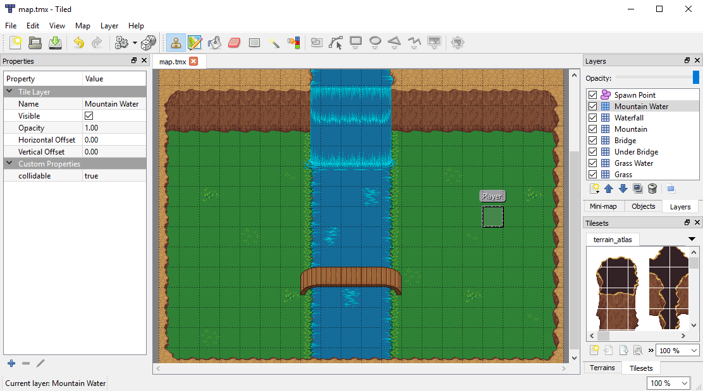
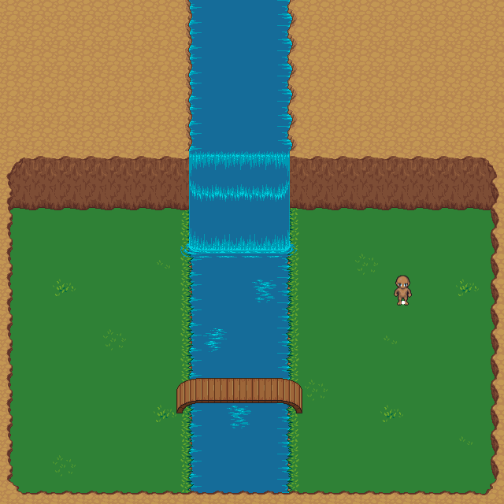
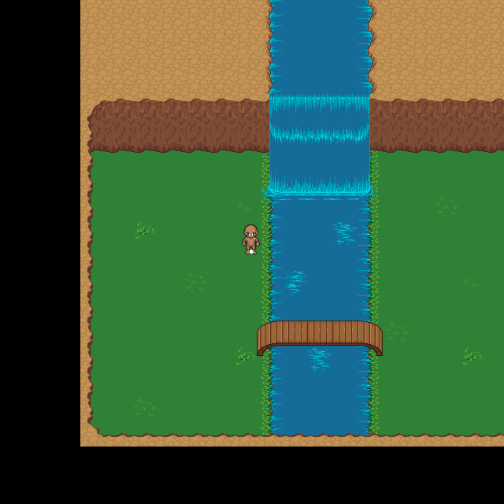
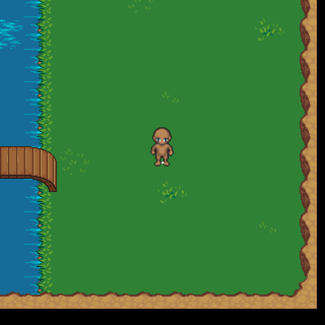

# Introduction to STI

This tutorial assumes that you are familiar enough with both Tiled and LÖVE that you can create a simple map and run LÖVE programs. If you have never used or heard of these program before, I highly recommend downloading them and tinkering with them a bit before continuing.

To begin, we want to create a simple map using Tiled. You can create your own tile atlas using any image editor, or download a free one from [Open Game Art](http://opengameart.org/). In my example map, I have created a map with several tile layers and a single object layer with an object named "Player". This object will be used later on to spawn our player so make sure you create and name at least one object.



With our map created, we want to export it as a Lua file by clicking `File > Export` or by pressing `ctrl+E` and selecting `Lua files (*.lua)`. It is worth noting that Tiled formats image paths relative to the map's location. You need to make sure that you save your map in the same directory structure that your game will be loading with, or else you might have trouble loading your map.

Now that we have our map export ready, it is time to start writing some code. We will start by creating `main.lua` and putting in a basic LÖVE skeleton. This skeleton will allow us to load our map and other assets, update our map every frame, and render the map to our screen.

```lua
function love.load()
end

function love.update(dt)
end

function love.draw()
end
```

With our skeleton made, we want to import the STI module, load the map, and get it drawing on screen. It is surprisingly easy to do as STI takes care of a lot of the work for you such as loading (and caching) images, batching the tiles for faster drawing, etc.

```lua
-- Include Simple Tiled Implementation into project
local sti = require "sti"

function love.load()
	-- Load map file
	map = sti("map.lua")
end

function love.update(dt)
	-- Update world
	map:update(dt)
end

function love.draw()
	-- Draw world
	map:draw()
end
```


Amazing! We added just four lines of code and now our map is being drawn! But hey, what is that ugly box? That is our `Player` object that we created. Obviously we don't want that to be a box so let's create a player object.

First we need to add a new `Custom Layer` to our map. This layer will be used for holding dynamic data that lives in our world such as players, doors, or other objects that can get added, modified, or removed throughout the lifecycle of the game.

```lua
function love.load()
	-- Load map file
	map = sti("map.lua")

	-- Create new dynamic data layer called "Sprites" as the 8th layer
	local layer = map:addCustomLayer("Sprites", 8)
end
```

With our new layer added, we want to populate it with some data. We want to take the `X` and `Y` position from our map object and give it to a new dynamic object that we will call `player`. We also want to load an image to use as the player's sprite, and we want to offset that image when it is drawn so the player's position is at the sprite's feet. The offset values I used here worked for my image, but you may need to experiment to get the right values for your sprite.

It is worth noting here that Tiled supports adding custom properties to any object or tile. You could store the offset values as object properties and then grab them from `object.properties` in Lua. In my example below, I simply hard coded the `ox` and `oy` values to keep things simple.

```lua
function love.load()
	-- Load map file
	map = sti("map.lua")

	-- Create new dynamic data layer called "Sprites" as the 8th layer
	local layer = map:addCustomLayer("Sprites", 8)

	-- Get player spawn object
	local player
	for k, object in pairs(map.objects) do
		if object.name == "Player" then
			player = object
			break
		end
	end

	-- Create player object
	local sprite = love.graphics.newImage("sprite.png")
	layer.player = {
		sprite = sprite,
		x      = player.x,
		y      = player.y,
		ox     = sprite:getWidth() / 2,
		oy     = sprite:getHeight() / 1.35
	}
end
```

With our player object created, we want to draw it on screen. Every layer in STI has its own `update` and `draw` callback functions that can be overridden if necessary. Each layer type has a default callback that can be accessed through STI's API except `Custom Layers` which have empty callbacks. To get our player to draw, we are going to need to override our new layer's `draw` callback.

We are also going to want to remove our old `Object Layer` since we've extracted all the data we need out of it. If we wanted to keep it around, we could set `layer.visible` to `false` to hide the ugly boxes, but we're just going to kill it.

```lua
function love.load()
	-- Load map file
	map = sti("map.lua")

	-- Create new dynamic data layer called "Sprites" as the 8th layer
	local layer = map:addCustomLayer("Sprites", 8)

	-- Get player spawn object
	local player
	for k, object in pairs(map.objects) do
		if object.name == "Player" then
			player = object
			break
		end
	end

	-- Create player object
	local sprite = love.graphics.newImage("sprite.png")
	layer.player = {
		sprite = sprite,
		x      = player.x,
		y      = player.y,
		ox     = sprite:getWidth() / 2,
		oy     = sprite:getHeight() / 1.35
	}

	-- Draw player
	layer.draw = function(self)
		love.graphics.draw(
			self.player.sprite,
			math.floor(self.player.x),
			math.floor(self.player.y),
			0,
			1,
			1,
			self.player.ox,
			self.player.oy
		)

		-- Temporarily draw a point at our location so we know
		-- that our sprite is offset properly
		love.graphics.setPointSize(5)
		love.graphics.points(math.floor(self.player.x), math.floor(self.player.y))
	end

	-- Remove unneeded object layer
	map:removeLayer("Spawn Point")
end
```



Whoa, there it is! Our player sprite! "But wait!" you might be saying, "you said this data was dynamic! Our object is just sitting there!". Well, you're right. This is a player object and we need to give it some controls. I am going to ignore the great advice from [this](http://lua.space/gamedev/handling-input-in-lua) tutorial for the sake of simplicity, but I do not recommend writing player controller code like this. Definitely check that tutorial out!

In our player controller, we will be overriding the `layer.update` callback to detect if certain keys are currently being pressed and if so, update the player's `x` and `y` positions by some predetermined speed value, in our case, 96 pixels per second, or three tiles. The key here is the *per second* bit. Since lots of computers run at lots of different speeds and frame rates, we can't hard code our per-frame values. We will be multiplying our speed by `dt` or `Delta Time`, a speed normalizer that LÖVE provides us. `dt` ensures that no matter how fast or slow the system running our game is, objects will move the same per-second distance.

```lua
function love.load()
	-- Load map file
	map = sti("map.lua")

	-- Create new dynamic data layer called "Sprites" as the 8th layer
	local layer = map:addCustomLayer("Sprites", 8)

	-- Get player spawn object
	local player
	for k, object in pairs(map.objects) do
		if object.name == "Player" then
			player = object
			break
		end
	end

	-- Create player object
	local sprite = love.graphics.newImage("sprite.png")
	layer.player = {
		sprite = sprite,
		x      = player.x,
		y      = player.y,
		ox     = sprite:getWidth() / 2,
		oy     = sprite:getHeight() / 1.35
	}

	-- Add controls to player
	layer.update = function(self, dt)
		-- 96 pixels per second
		local speed = 96 * dt

		-- Move player up
		if love.keyboard.isDown("w", "up") then
			self.player.y = self.player.y - speed
		end

		-- Move player down
		if love.keyboard.isDown("s", "down") then
			self.player.y = self.player.y + speed
		end

		-- Move player left
		if love.keyboard.isDown("a", "left") then
			self.player.x = self.player.x - speed
		end

		-- Move player right
		if love.keyboard.isDown("d", "right") then
			self.player.x = self.player.x + speed
		end
	end

	-- Draw player
	layer.draw = function(self)
		love.graphics.draw(
			self.player.sprite,
			math.floor(self.player.x),
			math.floor(self.player.y),
			0,
			1,
			1,
			self.player.ox,
			self.player.oy
		)

		-- Temporarily draw a point at our location so we know
		-- that our sprite is offset properly
		love.graphics.setPointSize(5)
		love.graphics.points(math.floor(self.player.x), math.floor(self.player.y))
	end

	-- Remove unneeded object layer
	map:removeLayer("Spawn Point")
end
```

Cool, we can now move our player around the screen! But that's only half the battle. We also want to centre the player in the screen so that the player never runs away from us. Instead, we want the world to move around our player. How do we accomplish this? LÖVE provides graphics transform tools such as `translate`, `rotate`, and `scale` that will give us the illusion that our player is static and the world is dynamic, instead of the other way around.

```lua
function love.draw()
	-- Translate world so that player is always centred
	local player = map.layers["Sprites"].player
	local tx = math.floor(player.x - love.graphics.getWidth()  / 2)
	local ty = math.floor(player.y - love.graphics.getHeight() / 2)

	-- Transform world
	love.graphics.translate(-tx, -ty)

	-- Draw world
	map:draw()
end
```



And there we have it, our player can walk around the world and always remain in the centre of our screen. We can also scale our world so that players using screens with different resolutions all see the same stuff instead of maybe having an advantage because your screen resolution is larger than someone else's, or having graphical glitches, or any other issue that could arise.

```lua
function love.draw()
	-- Scale world
	local scale = 2
	local screen_width  = love.graphics.getWidth()  / scale
	local screen_height = love.graphics.getHeight() / scale

	-- Translate world so that player is always centred
	local player = map.layers["Sprites"].player
	local tx = math.floor(player.x - screen_width  / 2)
	local ty = math.floor(player.y - screen_height / 2)

	-- Transform world
	love.graphics.scale(scale)
	love.graphics.translate(-tx, -ty)

	-- Draw world
	map:draw()
end
```



Alright, now let's put it all together and see what we've got!

```lua
-- Include Simple Tiled Implementation into project
local sti = require "sti"

function love.load()
	-- Load map file
	map = sti("map.lua")

	-- Create new dynamic data layer called "Sprites" as the 8th layer
	local layer = map:addCustomLayer("Sprites", 8)

	-- Get player spawn object
	local player
	for k, object in pairs(map.objects) do
		if object.name == "Player" then
			player = object
			break
		end
	end

	-- Create player object
	local sprite = love.graphics.newImage("sprite.png")
	layer.player = {
		sprite = sprite,
		x      = player.x,
		y      = player.y,
		ox     = sprite:getWidth() / 2,
		oy     = sprite:getHeight() / 1.35
	}

	-- Add controls to player
	layer.update = function(self, dt)
		-- 96 pixels per second
		local speed = 96 * dt

		-- Move player up
		if love.keyboard.isDown("w", "up") then
			self.player.y = self.player.y - speed
		end

		-- Move player down
		if love.keyboard.isDown("s", "down") then
			self.player.y = self.player.y + speed
		end

		-- Move player left
		if love.keyboard.isDown("a", "left") then
			self.player.x = self.player.x - speed
		end

		-- Move player right
		if love.keyboard.isDown("d", "right") then
			self.player.x = self.player.x + speed
		end
	end

	-- Draw player
	layer.draw = function(self)
		love.graphics.draw(
			self.player.sprite,
			math.floor(self.player.x),
			math.floor(self.player.y),
			0,
			1,
			1,
			self.player.ox,
			self.player.oy
		)

		-- Temporarily draw a point at our location so we know
		-- that our sprite is offset properly
		love.graphics.setPointSize(5)
		love.graphics.points(math.floor(self.player.x), math.floor(self.player.y))
	end

	-- Remove unneeded object layer
	map:removeLayer("Spawn Point")
end

function love.update(dt)
	-- Update world
	map:update(dt)
end

function love.draw()
	-- Scale world
	local scale = 2
	local screen_width  = love.graphics.getWidth()  / scale
	local screen_height = love.graphics.getHeight() / scale

	-- Translate world so that player is always centred
	local player = map.layers["Sprites"].player
	local tx = math.floor(player.x - screen_width  / 2)
	local ty = math.floor(player.y - screen_height / 2)

	-- Transform world
	love.graphics.scale(scale)
	love.graphics.translate(-tx, -ty)

	-- Draw world
	map:draw()
end
```

With only 100 lines of code, we've imported our map, created a player object, created a player controller, and can run around our world. Impressive!
